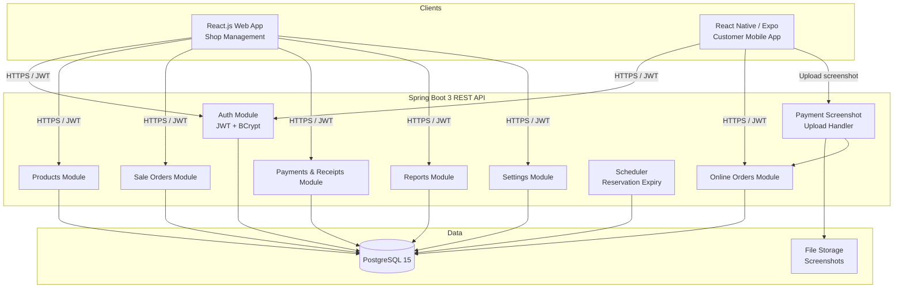
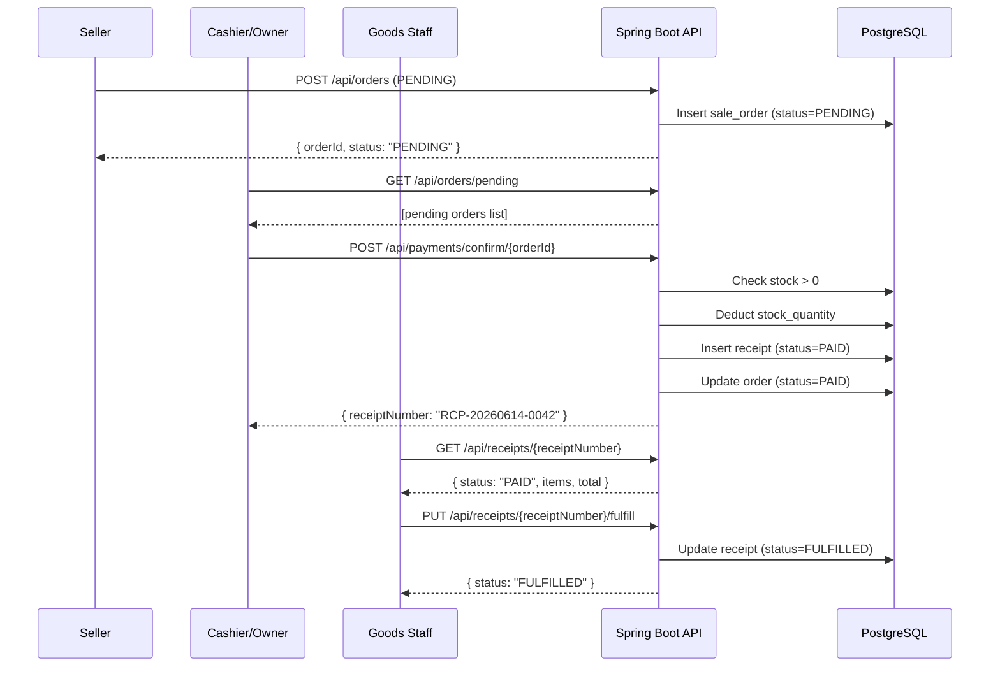
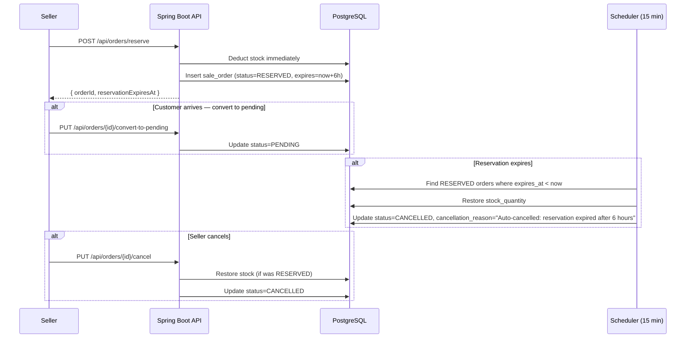
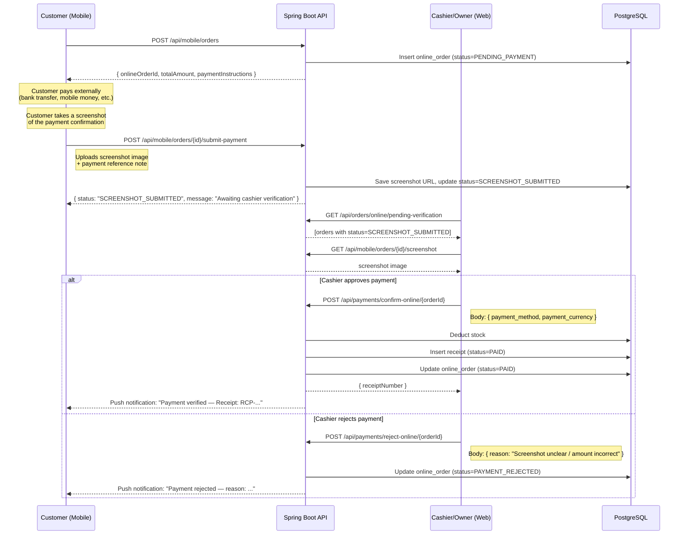

# Design Document: Shop Management System

## Overview

A dual-application platform consisting of a **Shop Management Web App** (React.js) and a **Customer E-Commerce Mobile App** (React Native / Expo), both powered by a single **Spring Boot 3 REST API** backed by **PostgreSQL 15**. The system supports an in-store workflow where Sellers create orders, Cashiers/Owners confirm payment and issue digital receipts, and Goods Staff verify receipts before releasing goods — while Customers can also shop online via the mobile app using a **screenshot-based manual payment verification flow** (no automated payment gateway).

The platform is role-driven with five distinct user roles (OWNER, CASHIER, SELLER, GOODS_STAFF, CUSTOMER) each with strictly scoped permissions. All monetary values are stored in KES and converted to ETB at display time using a configurable exchange rate. No self-registration exists anywhere in the system — all accounts are created by privileged users.

## Architecture




## Sequence Diagrams

### In-Store Sale Flow (SELLER → CASHIER → GOODS_STAFF)



### Reserved Order Flow



### Online Order Flow (Mobile Customer — Screenshot-Based Payment)




## Components and Interfaces

### Component 1: Authentication Module

**Purpose**: Stateless JWT-based authentication. Handles login by phone number or email. No self-registration endpoint.

**Interface**:
```java
// AuthController
POST /api/auth/login
  Request:  LoginRequest { phone_number: String, password: String }
  Response: AuthResponse { token: String, role: String, userId: UUID }

// Spring Security filter chain validates Bearer token on every protected request
// Rate limit: 5 attempts/minute per IP via bucket4j or similar
```

**Responsibilities**:
- Authenticate user by phone_number OR email + BCrypt password check
- Issue signed JWT (HS256, configurable expiry)
- Provide `UserDetails` to downstream security context
- Enforce rate limiting on login endpoint (max 5/min)
- Reject any request to non-existent `/api/auth/register` with 404

---

### Component 2: Products Module

**Purpose**: Full product lifecycle management. Exposes dual-currency prices. Guards `buying_price` from non-OWNER roles.

**Interface**:
```java
GET    /api/products            → List<ProductResponseDto>
POST   /api/products            → ProductResponseDto        [OWNER]
PUT    /api/products/{id}       → ProductResponseDto        [OWNER]
DELETE /api/products/{id}       → void (soft delete)        [OWNER]
GET    /api/products/low-stock  → List<ProductResponseDto>  [OWNER]

// ProductResponseDto (OWNER)
{ id, name, description, category, price_kes, price_etb,
  buying_price, stock_quantity, min_stock_alert, image_url,
  is_active, current_exchange_rate }

// ProductResponseDto (non-OWNER) — buying_price omitted
{ id, name, description, category, price_kes, price_etb,
  stock_quantity, image_url, is_active, current_exchange_rate }
```

**Responsibilities**:
- Soft-delete products (set `is_active = false`)
- Compute `price_etb = price_kes / exchange_rate` at query time
- Return current exchange rate in every product response
- Flag low-stock items when `stock_quantity <= min_stock_alert`
- Use separate DTO projection based on caller's role

---

### Component 3: Sale Orders Module

**Purpose**: Manages in-store order lifecycle (PENDING / RESERVED / PAID / CANCELLED).

**Interface**:
```java
POST /api/orders                          → SaleOrderDto  [SELLER]
POST /api/orders/reserve                  → SaleOrderDto  [SELLER]
GET  /api/orders/pending                  → List<SaleOrderDto> [OWNER, CASHIER]
GET  /api/orders/reserved                 → List<SaleOrderDto> [OWNER, CASHIER]
GET  /api/orders/my                       → List<SaleOrderDto> [SELLER]
PUT  /api/orders/{id}/cancel              → void          [SELLER, own only]
PUT  /api/orders/{id}/convert-to-pending  → SaleOrderDto  [SELLER, CASHIER]

// SaleOrderDto
{ id, sellerId, sellerName, status, totalAmount, items: [...],
  reservedForName, reservedForPhone, reservationExpiresAt, createdAt }
```

**Responsibilities**:
- Create PENDING order without touching stock
- Create RESERVED order: deduct stock immediately, set expiry = now + 6h
- Enforce SELLER-only creation; SELLER sees only own orders
- Cancel: restore stock if order was RESERVED
- Convert RESERVED → PENDING without stock change

---

### Component 4: Payments & Receipts Module

**Purpose**: Confirms payment, generates receipts, and manages goods release.

**Interface**:
```java
POST /api/payments/confirm/{orderId}          → ReceiptDto  [OWNER, CASHIER]
  Body: { payment_method: "CASH"|"CHAPA", payment_currency: "KES"|"ETB" }

GET  /api/receipts/{receiptNumber}            → ReceiptDto  [GOODS_STAFF, OWNER]
PUT  /api/receipts/{receiptNumber}/fulfill    → ReceiptDto  [GOODS_STAFF]

// ReceiptDto
{ receiptNumber, orderId, confirmedBy, totalAmount, amount,
  paymentCurrency, paymentMethod, status, items: [...], createdAt }
```

**Responsibilities**:
- On confirmation: check stock > 0, deduct stock (PENDING only), record `exchange_rate_used`, generate receipt number (`RCP-YYYYMMDD-NNNN`)
- Idempotency guard: prevent double-confirmation
- Return 409 if receipt already FULFILLED
- `exchange_rate_used` stored in DB, never returned in API response

---

### Component 5: Online Orders Module

**Purpose**: Customer-facing e-commerce order management via mobile app using screenshot-based manual payment verification.

**Interface**:
```java
GET  /api/mobile/products                          → List<MobileProductDto>    [CUSTOMER]
POST /api/mobile/orders                            → OnlineOrderDto            [CUSTOMER]
POST /api/mobile/orders/{id}/submit-payment        → OnlineOrderDto            [CUSTOMER]
  Body: multipart/form-data { screenshot: File, paymentReference: String }
GET  /api/mobile/orders/{id}/screenshot            → image file                [CASHIER, OWNER]
GET  /api/mobile/orders/my                         → List<OnlineOrderDto>      [CUSTOMER]
GET  /api/mobile/orders/{id}                       → OnlineOrderDto            [CUSTOMER]

GET  /api/orders/online/pending-verification       → List<OnlineOrderDto>      [CASHIER, OWNER]
POST /api/payments/confirm-online/{orderId}        → ReceiptDto                [CASHIER, OWNER]
  Body: { payment_method: "CASH"|"BANK_TRANSFER"|"MOBILE_MONEY",
          payment_currency: "KES"|"ETB" }
POST /api/payments/reject-online/{orderId}         → void                      [CASHIER, OWNER]
  Body: { reason: String }
```

**Responsibilities**:
- Customer places order → status `PENDING_PAYMENT`; order includes payment instructions (bank account / mobile money number set by owner in shop settings)
- Customer uploads payment screenshot + optional reference note → status `SCREENSHOT_SUBMITTED`; file stored on server; URL saved to `online_order.payment_screenshot_url`
- Cashier/Owner sees queue of all `SCREENSHOT_SUBMITTED` orders; fetches screenshot image for visual verification
- Cashier approves: deducts stock, generates receipt, sets status `PAID`
- Cashier rejects: sets status `PAYMENT_REJECTED` with reason; customer sees reason in app and can re-submit
- Customers see only own orders; filtered by authenticated user's ID

---

### Component 6: Reports Module

**Purpose**: OWNER-only financial and inventory analytics.

**Interface**:
```java
GET /api/reports/sales?from=&to=     → SalesReportDto     [OWNER]
GET /api/reports/sellers             → List<SellerReportDto> [OWNER]
GET /api/reports/inventory           → InventoryReportDto  [OWNER]
GET /api/reports/revenue?from=&to=   → RevenueReportDto    [OWNER]

// RevenueReportDto
{ totalRevenueKes, totalRevenueEtb, cogs, profit,
  profitMarginPercent, breakdown: [...] }
```

**Responsibilities**:
- All monetary totals returned in both KES and ETB
- Include COGS (sum of `buying_price × quantity`), profit, margin
- Filter by date range for sales/revenue reports

---

### Component 7: Settings Module

**Purpose**: Manages exchange rate history and shop configuration flags.

**Interface**:
```java
POST /api/settings/exchange-rate          → ExchangeRateDto  [OWNER]
  Body: { rate: 0.55 }
GET  /api/settings/exchange-rate          → ExchangeRateDto  [all authenticated]
GET  /api/settings/exchange-rate/history  → List<ExchangeRateDto> [OWNER]

GET  /api/settings                        → Map<String,String> [OWNER]
PUT  /api/settings                        → void               [OWNER]
  Body: { receipt_show_item_prices: "false" }
```

**Responsibilities**:
- Insert new rate record (never update old); most recent = active
- Return warning flag if active rate is > 24h old
- Persist shop settings as key-value pairs in `shop_settings` table

---

### Component 8: User Management Module

**Purpose**: OWNER controls all staff and customer accounts; SELLER can create CUSTOMER accounts only.

**Interface**:
```java
GET  /api/users                    → List<UserDto>  [OWNER]
POST /api/users                    → UserDto        [OWNER] — any role
POST /api/customers                → UserDto        [OWNER, SELLER] — role forced to CUSTOMER
PUT  /api/users/{id}/deactivate    → void           [OWNER]
PUT  /api/users/me/currency-preference → void       [all authenticated]
  Body: { currency: "KES"|"ETB" }
```

**Responsibilities**:
- Hash password with BCrypt before persisting
- `/api/customers` always sets `role = CUSTOMER` regardless of request body
- SELLER calling `/api/users` (staff list) returns 403
- Deactivated users (`is_active=false`) cannot log in

---

### Component 9: Reservation Scheduler

**Purpose**: Background job to auto-cancel expired reservations.

**Interface**:
```java
@Scheduled(fixedRate = 900_000) // every 15 minutes
void cancelExpiredReservations();
```

**Responsibilities**:
- Query all orders with `status = RESERVED AND reservation_expires_at < NOW()`
- For each: restore `stock_quantity`, set `status = CANCELLED`, set `cancellation_reason = "Auto-cancelled: reservation expired after 6 hours"`
- Run within a single transaction per batch


## Data Models

### Entity: User

```java
@Entity
@Table(name = "users")
public class User {
    UUID id;                    // PK, auto-generated
    String fullName;            // VARCHAR NOT NULL
    String phoneNumber;         // VARCHAR UNIQUE NOT NULL
    String email;               // VARCHAR NULLABLE
    String password;            // BCrypt hash
    Role role;                  // ENUM: OWNER, CASHIER, SELLER, GOODS_STAFF, CUSTOMER
    boolean isActive;           // default true
    String preferredCurrency;   // 'KES' or 'ETB', default 'ETB'
    LocalDateTime createdAt;    // auto-set
}
```

**Validation Rules**:
- `phoneNumber` must be unique and non-null (primary login identifier)
- `password` stored as BCrypt hash — never plaintext
- `role` cannot be changed after creation
- `isActive = false` blocks login; soft-delete only

---

### Entity: Product

```java
@Entity
@Table(name = "products")
public class Product {
    UUID id;
    String name;               // NOT NULL
    String description;        // TEXT
    String category;           // VARCHAR
    BigDecimal price;          // KES, NOT NULL
    BigDecimal buyingPrice;    // KES, nullable — OWNER only
    int stockQuantity;         // >= 0
    int minStockAlert;         // threshold for low-stock warnings
    String imageUrl;           // nullable
    boolean isActive;          // default true
    LocalDateTime createdAt;
}
```

**Validation Rules**:
- `price > 0`
- `stockQuantity >= 0` — never goes negative; enforce at service layer
- `buyingPrice` nullable; if provided, used for profit/margin reports

---

### Entity: SaleOrder

```java
@Entity
@Table(name = "sale_orders")
public class SaleOrder {
    UUID id;
    User seller;               // FK -> users
    SaleOrderStatus status;    // RESERVED | PENDING | PAID | CANCELLED
    BigDecimal totalAmount;    // KES
    String reservedForName;    // nullable
    String reservedForPhone;   // nullable
    LocalDateTime reservationExpiresAt; // nullable; set for RESERVED orders
    String cancellationReason; // nullable
    LocalDateTime createdAt;
    List<SaleOrderItem> items; // @OneToMany
}
```

**Validation Rules**:
- `status` transitions: PENDING → PAID | CANCELLED; RESERVED → PENDING | CANCELLED
- SELLER can only cancel own orders and only when not PAID
- `totalAmount` = sum of `(unit_price × quantity)` across items

---

### Entity: SaleOrderItem

```java
@Entity
@Table(name = "sale_order_items")
public class SaleOrderItem {
    UUID id;
    SaleOrder order;           // FK -> sale_orders
    Product product;           // FK -> products
    int quantity;              // > 0
    BigDecimal unitPrice;      // KES at time of order creation
}
```

---

### Entity: Receipt

```java
@Entity
@Table(name = "receipts")
public class Receipt {
    UUID id;
    String receiptNumber;      // UNIQUE, e.g. "RCP-20260614-0042"
    SaleOrder order;           // FK -> sale_orders, nullable
    OnlineOrder onlineOrder;   // FK -> online_orders, nullable
    User confirmedBy;          // FK -> users
    BigDecimal totalAmount;    // KES
    BigDecimal amount;         // in payment_currency
    String paymentCurrency;    // 'KES' or 'ETB'
    PaymentMethod paymentMethod; // CASH | CHAPA
    BigDecimal exchangeRateUsed; // audit only, never printed
    ReceiptStatus status;      // PAID | FULFILLED
    LocalDateTime createdAt;
}
```

**Validation Rules**:
- Either `order` or `onlineOrder` must be non-null (not both null)
- `receiptNumber` format: `RCP-{YYYYMMDD}-{4-digit sequence, zero-padded}`
- Status FULFILLED is terminal — no further transitions allowed

---

### Entity: OnlineOrder

```java
@Entity
@Table(name = "online_orders")
public class OnlineOrder {
    UUID id;
    User customer;                   // FK -> users (CUSTOMER role only)
    OnlineOrderStatus status;        // PENDING_PAYMENT | SCREENSHOT_SUBMITTED |
                                     // PAYMENT_REJECTED | PAID | PROCESSING |
                                     // READY | DELIVERED | CANCELLED
    BigDecimal totalAmount;          // KES
    String deliveryAddress;          // TEXT
    String paymentScreenshotUrl;     // nullable; set after customer submits screenshot
    String paymentReference;         // nullable; customer-supplied reference note
    String rejectionReason;          // nullable; set when cashier rejects
    LocalDateTime createdAt;
    List<OnlineOrderItem> items;
}
```

---

### Entity: ExchangeRateSetting

```java
@Entity
@Table(name = "exchange_rate_settings")
public class ExchangeRateSetting {
    UUID id;
    BigDecimal rate;           // divisor: ETB = KES ÷ rate
    String label;              // e.g. "1 KES = 1.82 ETB"
    User setBy;                // FK -> users (OWNER)
    LocalDateTime createdAt;
}
// Active rate = most recent record. All records kept (append-only).
```

---

### Entity: ShopSetting

```java
@Entity
@Table(name = "shop_settings")
public class ShopSetting {
    UUID id;
    String settingKey;         // UNIQUE, e.g. "receipt_show_item_prices"
    String settingValue;       // e.g. "true" / "false"
    User updatedBy;            // FK -> users (OWNER)
    LocalDateTime updatedAt;
}
// Default seed: receipt_show_item_prices = 'true'
```


## Key Functions with Formal Specifications

### Function 1: `AuthService.login()`

```java
AuthResponse login(LoginRequest request)
```

**Preconditions:**
- `request.phoneNumber` is non-null OR `request.email` is non-null
- The matching user exists in the `users` table
- Matched user has `is_active = true`

**Postconditions:**
- Returns `AuthResponse` with a signed JWT and the user's role
- JWT payload contains `sub = userId`, `role`, `iat`, `exp`
- If credentials invalid → throws `401 Unauthorized`
- If account inactive → throws `403 Forbidden`
- Rate limit counter for the caller IP is incremented

**Loop Invariants:** N/A (no loops)

---

### Function 2: `SaleOrderService.createOrder()`

```java
SaleOrderDto createOrder(CreateOrderRequest request, UUID sellerId)
```

**Preconditions:**
- Caller has role `SELLER`
- `request.items` is non-empty
- For each item: `product.is_active = true`, `item.quantity > 0`
- `product.stockQuantity >= item.quantity` is NOT required for PENDING (stock checked at payment)

**Postconditions:**
- A new `SaleOrder` is persisted with `status = PENDING`
- `totalAmount = Σ (product.price × item.quantity)`
- `unit_price` in each `SaleOrderItem` is snapshotted from `product.price` at creation time
- Stock is NOT deducted
- Returns `SaleOrderDto` with `status = PENDING`

**Loop Invariants:**
- For each item in `request.items`: item has been validated before being added to the order

---

### Function 3: `SaleOrderService.createReservedOrder()`

```java
SaleOrderDto createReservedOrder(CreateReservedOrderRequest request, UUID sellerId)
```

**Preconditions:**
- Caller has role `SELLER`
- `request.items` is non-empty
- For each item: `product.stockQuantity >= item.quantity` (stock available)

**Postconditions:**
- A new `SaleOrder` is persisted with `status = RESERVED`
- `reservationExpiresAt = NOW() + 6 hours`
- Stock is deducted immediately: `product.stockQuantity -= item.quantity` for each item
- `totalAmount` computed same as `createOrder`

**Loop Invariants:**
- After processing item `i`: all products for items `0..i` have had stock decremented
- If any item fails stock check, the entire transaction is rolled back (no partial deductions)

---

### Function 4: `PaymentService.confirmPayment()`

```java
ReceiptDto confirmPayment(UUID orderId, ConfirmPaymentRequest request, User confirmer)
```

**Preconditions:**
- Caller has role `OWNER` or `CASHIER`
- Order exists with `status = PENDING`
- For each order item: `product.stockQuantity >= item.quantity`
- `request.paymentMethod ∈ {CASH, CHAPA}`
- `request.paymentCurrency ∈ {KES, ETB}`

**Postconditions:**
- Stock deducted: `product.stockQuantity -= item.quantity` for each item
- Order `status` updated to `PAID`
- Receipt created with:
  - `receiptNumber = generateReceiptNumber()` (unique, `RCP-YYYYMMDD-NNNN`)
  - `exchangeRateUsed = activeExchangeRate.rate`
  - `amount = totalAmount` (if KES) or `totalAmount / exchangeRateUsed` (if ETB)
  - `status = PAID`
- Returns `ReceiptDto` (excludes `exchangeRateUsed`)
- If any item is out of stock → throws `409 Conflict` (stock restored, order stays PENDING)

**Loop Invariants:**
- For each item processed: stock decremented, item marked as fulfilled in the batch

---

### Function 5: `ReceiptService.fulfillReceipt()`

```java
ReceiptDto fulfillReceipt(String receiptNumber, User goodsStaff)
```

**Preconditions:**
- Caller has role `GOODS_STAFF`
- Receipt exists with the given `receiptNumber`
- Receipt `status = PAID`

**Postconditions:**
- Receipt `status` updated to `FULFILLED`
- Returns updated `ReceiptDto`
- If `status` was already `FULFILLED` → throws `409 Conflict` with message `"Receipt already fulfilled."`
- No stock changes (stock already deducted at payment)

**Loop Invariants:** N/A

---

### Function 6: `ExchangeRateService.convertKesToDisplay()`

```java
BigDecimal convertKesToDisplay(BigDecimal amountKes, String preferredCurrency)
```

**Preconditions:**
- `amountKes >= 0`
- `preferredCurrency ∈ {KES, ETB}`
- Active exchange rate record exists

**Postconditions:**
- If `preferredCurrency = KES`: returns `amountKes` unchanged
- If `preferredCurrency = ETB`: returns `amountKes / activeRate` rounded to 2 decimal places
- Never returns a negative value
- Throws `IllegalStateException` if no exchange rate has been configured

**Loop Invariants:** N/A

---

### Function 7: `ReservationScheduler.cancelExpiredReservations()`

```java
@Scheduled(fixedRate = 900_000)
void cancelExpiredReservations()
```

**Preconditions:**
- Current time is accessible
- Database is reachable

**Postconditions:**
- All orders matching `status = RESERVED AND reservationExpiresAt < NOW()` are updated:
  - `status = CANCELLED`
  - `cancellationReason = "Auto-cancelled: reservation expired after 6 hours"`
  - For each item: `product.stockQuantity += item.quantity` (stock restored)
- Entire batch executes in a single transaction (all succeed or all roll back)

**Loop Invariants:**
- After processing order `i`: stock for all its items has been restored; status set to CANCELLED
- Previously cancelled orders are not reprocessed


## Algorithmic Pseudocode

### Algorithm 1: In-Store Payment Confirmation

```pascal
ALGORITHM confirmPayment(orderId, paymentMethod, paymentCurrency, confirmer)
INPUT:  orderId (UUID), paymentMethod (CASH|CHAPA),
        paymentCurrency (KES|ETB), confirmer (User)
OUTPUT: receipt (ReceiptDto)

BEGIN
  ASSERT confirmer.role IN {OWNER, CASHIER}

  order ← repository.findOrderById(orderId)

  IF order = NULL THEN
    THROW NotFoundException("Order not found")
  END IF

  IF order.status ≠ PENDING THEN
    THROW ConflictException("Order must be in PENDING status")
  END IF

  // Stock validation pass
  FOR each item IN order.items DO
    product ← item.product
    IF product.stockQuantity < item.quantity THEN
      THROW ConflictException("Insufficient stock for: " + product.name)
    END IF
  END FOR

  // Begin atomic transaction
  BEGIN TRANSACTION
    // Deduct stock
    FOR each item IN order.items DO
      item.product.stockQuantity ← item.product.stockQuantity - item.quantity
      repository.saveProduct(item.product)
    END FOR

    // Update order status
    order.status ← PAID
    repository.saveOrder(order)

    // Compute receipt amount
    activeRate ← settings.getActiveExchangeRate()
    IF paymentCurrency = KES THEN
      amount ← order.totalAmount
    ELSE
      amount ← order.totalAmount / activeRate.rate
    END IF

    // Generate unique receipt number
    receiptNumber ← generateReceiptNumber(TODAY())

    // Persist receipt
    receipt ← new Receipt {
      receiptNumber   = receiptNumber,
      order           = order,
      confirmedBy     = confirmer,
      totalAmount     = order.totalAmount,
      amount          = amount,
      paymentCurrency = paymentCurrency,
      paymentMethod   = paymentMethod,
      exchangeRateUsed = activeRate.rate,
      status          = PAID
    }
    repository.saveReceipt(receipt)
  COMMIT TRANSACTION

  RETURN ReceiptDto(receipt)  // exchangeRateUsed excluded from DTO
END
```

---

### Algorithm 2: Receipt Number Generation

```pascal
ALGORITHM generateReceiptNumber(date)
INPUT:  date (LocalDate)
OUTPUT: receiptNumber (String)

BEGIN
  dateStr ← format(date, "YYYYMMDD")  // e.g. "20260614"

  // Get today's sequence within a DB-level lock
  BEGIN LOCKED TRANSACTION
    todayCount ← repository.countReceiptsByDate(date)
    sequence   ← todayCount + 1
  COMMIT LOCKED TRANSACTION

  paddedSeq ← leftPad(sequence, 4, '0')  // e.g. 42 → "0042"
  receiptNumber ← "RCP-" + dateStr + "-" + paddedSeq

  ASSERT receiptNumber MATCHES pattern "RCP-\d{8}-\d{4}"
  RETURN receiptNumber
END
```

---

### Algorithm 3: Auto-Cancellation of Expired Reservations

```pascal
ALGORITHM cancelExpiredReservations()
INPUT:  (none — reads system clock)
OUTPUT: (side effects only)

BEGIN
  now ← getCurrentTimestamp()

  expiredOrders ← repository.findAll(
    status = RESERVED AND reservationExpiresAt < now
  )

  IF expiredOrders IS EMPTY THEN
    RETURN  // Nothing to process
  END IF

  BEGIN TRANSACTION
    FOR each order IN expiredOrders DO
      // INVARIANT: all items of orders 0..(i-1) have been stock-restored
      FOR each item IN order.items DO
        item.product.stockQuantity ← item.product.stockQuantity + item.quantity
        repository.saveProduct(item.product)
      END FOR

      order.status             ← CANCELLED
      order.cancellationReason ← "Auto-cancelled: reservation expired after 6 hours"
      repository.saveOrder(order)
    END FOR
  COMMIT TRANSACTION
END
```

---

### Algorithm 4: Online Payment Screenshot Verification

```pascal
ALGORITHM confirmOnlinePayment(orderId, paymentMethod, paymentCurrency, confirmer)
INPUT:  orderId (UUID), paymentMethod (BANK_TRANSFER|MOBILE_MONEY|CASH),
        paymentCurrency (KES|ETB), confirmer (User)
OUTPUT: receipt (ReceiptDto)

BEGIN
  ASSERT confirmer.role IN {OWNER, CASHIER}

  onlineOrder ← repository.findOnlineOrderById(orderId)

  IF onlineOrder = NULL THEN
    THROW NotFoundException("Online order not found")
  END IF

  IF onlineOrder.status ≠ SCREENSHOT_SUBMITTED THEN
    THROW ConflictException("Order must be in SCREENSHOT_SUBMITTED status")
  END IF

  // Stock validation pass
  FOR each item IN onlineOrder.items DO
    IF item.product.stockQuantity < item.quantity THEN
      THROW ConflictException("Insufficient stock for: " + item.product.name)
    END IF
  END FOR

  BEGIN TRANSACTION
    // Deduct stock
    FOR each item IN onlineOrder.items DO
      item.product.stockQuantity ← item.product.stockQuantity - item.quantity
      repository.saveProduct(item.product)
    END FOR

    // Update order status
    onlineOrder.status ← PAID
    repository.saveOnlineOrder(onlineOrder)

    // Compute receipt amount
    activeRate ← settings.getActiveExchangeRate()
    IF paymentCurrency = KES THEN
      amount ← onlineOrder.totalAmount
    ELSE
      amount ← onlineOrder.totalAmount / activeRate.rate
    END IF

    receiptNumber ← generateReceiptNumber(TODAY())

    receipt ← new Receipt {
      receiptNumber    = receiptNumber,
      onlineOrder      = onlineOrder,
      confirmedBy      = confirmer,
      totalAmount      = onlineOrder.totalAmount,
      amount           = amount,
      paymentCurrency  = paymentCurrency,
      paymentMethod    = paymentMethod,
      exchangeRateUsed = activeRate.rate,
      status           = PAID
    }
    repository.saveReceipt(receipt)
  COMMIT TRANSACTION

  RETURN ReceiptDto(receipt)
END

ALGORITHM rejectOnlinePayment(orderId, reason, confirmer)
INPUT:  orderId (UUID), reason (String), confirmer (User)
OUTPUT: void

BEGIN
  ASSERT confirmer.role IN {OWNER, CASHIER}

  onlineOrder ← repository.findOnlineOrderById(orderId)

  IF onlineOrder.status ≠ SCREENSHOT_SUBMITTED THEN
    THROW ConflictException("Order must be in SCREENSHOT_SUBMITTED status")
  END IF

  onlineOrder.status          ← PAYMENT_REJECTED
  onlineOrder.rejectionReason ← reason
  repository.saveOnlineOrder(onlineOrder)
  // Customer sees rejection reason in app and may re-submit screenshot
END
```

---

### Algorithm 5: Dual-Currency Price Computation

```pascal
ALGORITHM computeProductPrices(product, callerRole)
INPUT:  product (Product), callerRole (Role)
OUTPUT: ProductResponseDto

BEGIN
  activeRate ← settings.getActiveExchangeRate()

  priceKes ← product.price
  priceEtb ← priceKes / activeRate.rate  // rounded to 2 dp

  dto ← new ProductResponseDto {
    id                   = product.id,
    name                 = product.name,
    price_kes            = priceKes,
    price_etb            = priceEtb,
    current_exchange_rate = activeRate.rate,
    stockQuantity        = product.stockQuantity,
    isActive             = product.isActive
  }

  IF callerRole = OWNER THEN
    dto.buyingPrice ← product.buyingPrice
    dto.profit      ← priceKes - product.buyingPrice   // null if buyingPrice null
    IF product.buyingPrice ≠ NULL AND product.buyingPrice > 0 THEN
      dto.margin ← ((priceKes - product.buyingPrice) / priceKes) × 100
    END IF
  END IF

  RETURN dto
END
```


## Correctness Properties

*A property is a characteristic or behavior that should hold true across all valid executions of a system — essentially, a formal statement about what the system should do. Properties serve as the bridge between human-readable specifications and machine-verifiable correctness guarantees.*

The following properties must hold universally across the system at all times.

### Property 1: Stock Non-Negativity

*For any* product in the system, after any sequence of order creation, payment confirmation, reservation, cancellation, or auto-expiry operations, `product.stockQuantity` SHALL remain greater than or equal to zero. Any operation that would reduce stock below zero must be rejected before any database write occurs.

```
∀ product p: p.stockQuantity ≥ 0
```

**Validates: Requirements 4.1, 4.2, 4.3, 5.1, 5.2, 6.3, 9.3, 9.4**

---

### Property 2: Payment Authorization

*For any* receipt in the system, the user who confirmed the payment must have role OWNER or CASHIER. No receipt can be generated by any other role.

```
∀ receipt r: r was created ⟹ r.confirmedBy.role ∈ {OWNER, CASHIER}
```

**Validates: Requirements 5.1, 9.3, 14.3**

---

### Property 3: Receipt Fulfill Idempotency

*For any* receipt with `status = FULFILLED`, any subsequent call to `PUT /api/receipts/{receiptNumber}/fulfill` SHALL return `409 Conflict` and leave the receipt unchanged. FULFILLED is a terminal state.

```
∀ receipt r: r.status = FULFILLED ⟹ r.status cannot transition to any other status
```

**Validates: Requirements 5.7, 5.8**

---

### Property 4: Sale Order Status Monotonicity

*For any* SaleOrder, the status transitions must follow the valid state machine: PENDING → PAID | CANCELLED; RESERVED → PENDING | CANCELLED. No order can transition from PAID or CANCELLED to any other state.

```
∀ sale_order o:
  PAID ∉ reachable_from(CANCELLED)
  CANCELLED ∉ reachable_from(PAID)
  PAID ∉ reachable_from(PENDING) without payment confirmation
```
Valid transitions: PENDING → PAID, PENDING → CANCELLED, RESERVED → PENDING, RESERVED → CANCELLED.

**Validates: Requirements 4.1, 4.2, 4.4, 4.8**

---

### Property 5: Stock-Deduction Consistency

*For any* SaleOrder at any point in its lifecycle, the stock state must be consistent with the order's status: RESERVED orders have stock already deducted; PENDING orders have stock intact; PAID orders have stock deducted exactly once; CANCELLED-from-RESERVED orders have stock fully restored.

```
∀ sale_order o:
  o.status = RESERVED ⟹ stock was deducted at order creation
  o.status = PENDING  ⟹ stock not yet deducted (deducted at payment)
  o.status = PAID     ⟹ stock has been deducted exactly once
  o.status = CANCELLED AND was RESERVED ⟹ stock has been restored
```

**Validates: Requirements 4.1, 4.2, 4.4, 5.1, 6.3**

---

### Property 6: Reservation Expiry and Stock Restoration

*For any* SaleOrder with `status = RESERVED` and `reservationExpiresAt < NOW()`, the Scheduler SHALL cancel the order and restore all stock quantities within 15 minutes of expiry. The stock restored must equal the exact quantities that were deducted at reservation time.

```
∀ sale_order o: o.status = RESERVED AND o.reservationExpiresAt < NOW()
  ⟹ o will be CANCELLED within 15 minutes and stock restored
```

**Validates: Requirements 6.2, 6.3, 6.4**

---

### Property 7: Customer Data Isolation

*For any* authenticated CUSTOMER, the list of orders returned by `GET /api/mobile/orders/my` SHALL contain only orders where `onlineOrder.customer.id = authenticatedUser.id`. A call to `GET /api/mobile/orders/{id}` for an order belonging to a different customer SHALL return `403 Forbidden`.

```
∀ customer c, online_order o:
  o is returned in /api/mobile/orders/my ⟹ o.customer.id = c.id
```

**Validates: Requirements 7.2, 7.3**

---

### Property 8: Online Payment Screenshot Integrity

*For any* OnlineOrder with `status = PAID`, there must exist a CASHIER or OWNER who explicitly confirmed payment after the order was in `SCREENSHOT_SUBMITTED` status, and `paymentScreenshotUrl` must be non-null. An online order is never marked PAID automatically.

```
∀ online_order o: o.status = PAID
  ⟹ ∃ cashier/owner u: u confirmed payment after visually verifying screenshot
     AND o.paymentScreenshotUrl ≠ NULL
```

**Validates: Requirements 8.1, 9.3**

---

### Property 9: buying_price Confidentiality

*For any* user whose role is not OWNER, no product response from any endpoint shall contain the `buying_price` field. The system uses two separate DTO projections to enforce this at the type level, never relying on runtime conditional nulling.

```
∀ user u, product p:
  u.role ≠ OWNER ⟹ buying_price ∉ response(GET /api/products, u)
               AND buying_price ∉ response(GET /api/mobile/products, u)
```

**Validates: Requirements 3.2, 3.3, 3.9, 14.4**

---

### Property 10: Receipt Number Uniqueness

*For any* two distinct receipts in the system, their receipt numbers must be different. Concurrent generation of receipt numbers under load must still produce globally unique values.

```
∀ receipts r1, r2: r1 ≠ r2 ⟹ r1.receiptNumber ≠ r2.receiptNumber
```
Receipt numbers are globally unique. The generation algorithm uses a database-level sequence lock.

**Validates: Requirements 5.5**

---

### Property 11: Currency Conversion Correctness

*For any* positive KES amount `a` and positive exchange rate `r`, the ETB display value must equal `a / r` rounded to 2 decimal places. The conversion must never return a negative value for non-negative input.

```
∀ amount_kes a, rate r (r > 0):
  display_etb(a, r) = round(a / r, 2)
  display_kes(a)    = a
  display_etb(a, r) > 0 ⟺ a > 0
```

**Validates: Requirements 11.1, 11.9**

---

### Property 12: No Self-Registration

*For all* callers, `POST /api/auth/register` SHALL return `404 Not Found`. All user accounts must be created through privileged endpoints (`POST /api/users` or `POST /api/customers`) by authorised staff.

```
POST /api/auth/register ⟹ returns 404 for all callers
```

**Validates: Requirements 1.1**

---

### Property 13: /api/customers Endpoint Forces CUSTOMER Role

*For any* caller with role OWNER or SELLER, and *for any* value of the `role` field in the request body to `POST /api/customers`, the created account SHALL always have `role = CUSTOMER`.

```
∀ request r to POST /api/customers: r.role ∈ {any}
  ⟹ created_user.role = CUSTOMER
```

**Validates: Requirements 1.3, 1.4**

---

### Property 14: Password Storage as BCrypt Hash

*For any* user account created or updated in the system, the value stored in the `password` column SHALL be a BCrypt hash (cost factor ≥ 10). Plaintext passwords shall never appear in the database.

```
∀ user u: stored(u.password) matches BCrypt format ∧ BCrypt.cost(u.password) ≥ 10
```

**Validates: Requirements 1.8, 15.2**

---

### Property 15: Seller Order Isolation

*For any* SELLER `s`, the list returned by `GET /api/orders/my` SHALL contain only orders where `saleOrder.sellerId = s.id`. Seller `s` must receive `403 Forbidden` when attempting to cancel an order belonging to a different seller.

```
∀ seller s, sale_order o:
  o ∈ GET /api/orders/my (as s) ⟹ o.sellerId = s.id
  cancel(o, s) where o.sellerId ≠ s.id ⟹ 403 Forbidden
```

**Validates: Requirements 4.5, 4.10**

---

### Property 16: Online Order Status Machine

*For any* OnlineOrder, status transitions must follow the defined state machine. No invalid transition (e.g., from DELIVERED to any other state, or from PAID directly to SCREENSHOT_SUBMITTED) shall be permitted.

```
∀ online_order o:
  valid transitions only:
    PENDING_PAYMENT → SCREENSHOT_SUBMITTED
    SCREENSHOT_SUBMITTED → PAID | PAYMENT_REJECTED
    PAYMENT_REJECTED → SCREENSHOT_SUBMITTED
    PAID → PROCESSING → READY → DELIVERED
    any non-terminal → CANCELLED
  terminal states: DELIVERED, CANCELLED (no further transitions)
```

**Validates: Requirements 10.1, 10.2**

---

### Property 17: Exchange Rate Append-Only and Active Rate Selection

*For any* sequence of exchange rate insertions, the total count of rate records must grow by 1 for each insertion (no updates to existing records), and the active rate must always equal the most recently inserted record.

```
∀ exchange_rate_settings after N insertions:
  count(exchange_rate_settings) = N
  active_rate = most_recently_inserted_record
```

**Validates: Requirements 11.2, 11.3, 11.4, 11.5**

---

### Property 18: Low-Stock Filtering Correctness

*For any* set of products with varying stock quantities and alert thresholds, `GET /api/products/low-stock` SHALL return exactly the products where `stock_quantity <= min_stock_alert` — no more, no less.

```
∀ product p:
  p ∈ GET /api/products/low-stock ⟺ p.stockQuantity ≤ p.minStockAlert
```

**Validates: Requirements 3.7**

---

### Property 19: Revenue Report Aggregation Correctness

*For any* set of fulfilled receipts in a date range, the revenue report values must satisfy: `totalRevenueKes = Σ receipt.totalAmount`, `cogs = Σ (buying_price × quantity)`, `profit = totalRevenueKes − cogs`, and `profitMarginPercent = (profit / totalRevenueKes) × 100`.

```
∀ date range [from, to]:
  report.totalRevenueKes = Σ r.totalAmount for r.createdAt ∈ [from, to]
  report.cogs = Σ (item.buying_price × item.quantity) for items in [from, to]
  report.profit = report.totalRevenueKes - report.cogs
  report.profitMarginPercent = (report.profit / report.totalRevenueKes) × 100
```

**Validates: Requirements 13.2**

---

### Property 20: JSON Serialization Round-Trip

*For any* valid domain object (Product, SaleOrder, OnlineOrder, Receipt, User), serialising the object to a JSON response DTO and then deserialising it back SHALL produce an object equivalent to the original.

```
∀ domain object x: deserialize(serialize(x)) ≡ x
```

**Validates: Requirements 16.3**


## Error Handling

### Scenario 1: Login Failure

**Condition**: Invalid phone/email or wrong password, or inactive account
**Response**: `401 Unauthorized` — `"Invalid credentials"` (never reveal which field failed); `403 Forbidden` if account inactive
**Recovery**: Client presents login error; rate limiter increments counter (max 5/min per IP → `429 Too Many Requests`)

---

### Scenario 2: Insufficient Stock at Payment

**Condition**: `product.stockQuantity < item.quantity` when OWNER/CASHIER attempts to confirm payment
**Response**: `409 Conflict` — `"Insufficient stock for product: [name]. Available: [n], Requested: [m]"`
**Recovery**: Transaction rolled back; order stays `PENDING`; cashier informs seller; seller may edit/cancel order

---

### Scenario 3: Double Fulfillment Attempt

**Condition**: `PUT /api/receipts/{receiptNumber}/fulfill` called on a receipt with `status = FULFILLED`
**Response**: `409 Conflict` — `"Receipt already fulfilled."`
**Recovery**: No state change; goods staff notified visually; audit log unchanged

---

### Scenario 4: Payment Screenshot Upload Failure

**Condition**: Customer submits screenshot but file upload fails (oversized, wrong format, network error)
**Response**: `400 Bad Request` — `"Invalid file. Please upload a JPG or PNG image under 5MB."`
**Recovery**: Customer retries upload; order stays `PENDING_PAYMENT`

---

### Scenario 5: Cashier Rejects Payment Screenshot

**Condition**: Cashier reviews uploaded screenshot and finds it invalid (wrong amount, unreadable, old transaction)
**Response**: `200 OK`; order status set to `PAYMENT_REJECTED` with reason stored
**Recovery**: Customer receives rejection reason in the app and can re-submit a correct screenshot; order moves back to allow re-submission

---

### Scenario 5: Expired Reservation Access

**Condition**: Seller or cashier tries to convert/confirm an order that the scheduler just cancelled
**Response**: `409 Conflict` — `"Order is no longer in RESERVED/PENDING status"`
**Recovery**: Client refreshes order list; cancelled order visible in history

---

### Scenario 6: Unauthorized Role Access

**Condition**: User attempts an endpoint forbidden for their role (e.g., SELLER calling `POST /api/payments/confirm`)
**Response**: `403 Forbidden` — `"Access denied"`
**Recovery**: Client hides forbidden actions from UI; server enforces at security layer regardless

---

### Scenario 7: Stale Exchange Rate

**Condition**: Last exchange rate set > 24 hours ago
**Response**: API responses include `{ staleRateWarning: true }` flag; no functional block
**Recovery**: OWNER updates rate via `POST /api/settings/exchange-rate`; warning disappears

---

### Scenario 8: Concurrent Stock Deduction

**Condition**: Two payment confirmations for different orders touch the same product simultaneously
**Response**: Database-level optimistic locking (`@Version` on `Product`) detects conflict → one transaction retries, other may get `409 Conflict`
**Recovery**: Losing request retried once; if still fails, returns error to cashier

---

### Scenario 9: JWT Expired or Tampered

**Condition**: Client sends expired or invalid JWT
**Response**: `401 Unauthorized` — `"Token invalid or expired"`
**Recovery**: Client redirects to login; session cleared from local storage/AsyncStorage

---

### Scenario 10: Order Not Found

**Condition**: Any request references a non-existent `orderId` or `receiptNumber`
**Response**: `404 Not Found` — `"Order not found"` / `"Receipt not found"`
**Recovery**: Client shows user-friendly message


## Testing Strategy

### Unit Testing Approach

Test each service class in isolation using Mockito mocks for repositories and external clients.

Key unit test cases:
- `AuthService`: valid login, wrong password, inactive user, rate limit exceeded
- `SaleOrderService`: PENDING order creation (stock not touched), RESERVED order (stock deducted), cancel restores stock
- `PaymentService`: successful confirmation, insufficient stock (transaction rollback), double confirmation blocked
- `ReceiptService`: fulfill PAID receipt, 409 on double fulfill
- `ExchangeRateService`: ETB conversion formula correctness, stale rate detection
- `ReservationScheduler`: expired orders cancelled in batch, non-expired orders untouched

### Property-Based Testing Approach

**Property Test Library**: `jqwik` (Java property-based testing, works with JUnit 5)

Key property tests:
- **Stock non-negativity**: For any sequence of order/cancel/fulfill operations on random stock quantities, `product.stockQuantity ≥ 0` always holds
- **Currency conversion round-trip**: For any `amountKes > 0` and `rate > 0`, `convertEtbToKes(convertKesToEtb(amount, rate), rate) ≈ amount` (within floating point tolerance)
- **Receipt number uniqueness**: Generating N receipt numbers concurrently across threads produces N distinct values
- **Order status machine**: A random walk through valid status transitions never produces an invalid terminal state

### Integration Testing Approach

Use Spring Boot's `@SpringBootTest` with an in-memory H2 or Testcontainers PostgreSQL instance.

Key integration tests:
- Full in-store flow: create order → confirm payment → generate receipt → fulfill → 409 on second fulfill
- Full reservation flow: create reserved → scheduler cancels after mock expiry → stock restored
- Chapa webhook: send mock webhook with valid/invalid signature → assert correct state changes
- Role-based access: each endpoint tested with each role to confirm 200/403 matrix
- Currency display: product prices returned with both KES and ETB values based on caller's `preferred_currency`


## Performance Considerations

- **Receipt number generation**: Uses a database sequence or `SELECT COUNT` with a pessimistic lock to avoid collisions under concurrent requests. For high-volume shops, a dedicated PostgreSQL sequence (`receipt_seq`) is preferred over `COUNT(*)`.
- **Reservation scheduler**: Processes expired orders in batches. If volume grows, add a compound index on `(status, reservation_expires_at)` to avoid full table scans.
- **Product listing**: Cache the active exchange rate in memory (e.g., Caffeine cache with 5-minute TTL) to avoid a DB hit on every product list call.
- **Reports**: Sales and revenue reports aggregate over potentially large receipt tables. Add composite indexes on `(created_at)` and `(status, created_at)` on `receipts`, `sale_orders`, and `online_orders`.
- **Screenshot upload idempotency**: If a customer re-submits a screenshot after rejection, overwrite the previous screenshot URL. Only one screenshot is active per order at a time.


## Security Considerations

- **JWT secret**: Stored as an environment variable (`JWT_SECRET`), never in source code or config files checked into Git.
- **BCrypt cost factor**: Use minimum cost 10 (default). Adjust upward if hardware allows.
- **Rate limiting on `/api/auth/login`**: 5 requests/minute per IP. Implemented with `bucket4j` + an in-memory or Redis store.
- **Screenshot file security**: Validate MIME type and file size server-side (max 5 MB, accept only image/jpeg and image/png). Store files outside the web root or use a private bucket. Never serve screenshots to unauthenticated users — require CASHIER or OWNER role to fetch them.
- **Screenshot storage path**: Use UUID-based filenames (not original customer filenames) to prevent path traversal attacks.
- **No register endpoint**: `POST /api/auth/register` must explicitly return `404` to prevent accidental exposure.
- **RBAC enforcement**: Role checks at the service layer (not just controller) using `@PreAuthorize` annotations. Even if a URL filter is misconfigured, service-level guards remain.
- **`buying_price` isolation**: Use two separate DTO projections — `ProductOwnerDto` (includes buying_price) and `ProductPublicDto`. Never conditionally null the field at runtime; use type-safe projections.
- **SQL injection**: Exclusively use Spring Data JPA / JPQL / named parameters. No native string concatenation in queries.
- **CORS**: Configure allowed origins to the specific React app domain in production. Never use wildcard `*` with credentials.
- **HTTPS only**: Enforce TLS in production. Reject HTTP connections at load balancer/reverse proxy level.
- **Sensitive fields in logs**: Mask `password`, `phone_number`, and `payment_reference` in all log outputs using a log filter or structured logging framework configuration.

Now let me check if requirements.md exists and proceed accordingly.


## Dependencies

### Backend (Spring Boot 3 / Java 17)
| Dependency | Version | Purpose |
|---|---|---|
| `spring-boot-starter-web` | 3.x | REST controllers |
| `spring-boot-starter-security` | 3.x | Security filter chain |
| `spring-boot-starter-data-jpa` | 3.x | ORM / Hibernate |
| `spring-boot-starter-validation` | 3.x | Bean validation |
| `spring-boot-starter-actuator` | 3.x | Health checks |
| `postgresql` | 42.x | JDBC driver |
| `jjwt-api` + `jjwt-impl` | 0.12.x | JWT generation/parsing |
| `spring-security-crypto` | (bundled) | BCrypt |
| `bucket4j-core` | 8.x | Rate limiting |
| `jqwik` | 1.x | Property-based testing |
| `testcontainers-postgresql` | 1.x | Integration test DB |

### Web Frontend (React.js)
| Dependency | Version | Purpose |
|---|---|---|
| `react` + `react-dom` | 18.x | UI framework |
| `react-router-dom` | 6.x | Client-side routing |
| `tailwindcss` | 3.x | Utility-first CSS |
| `axios` | 1.x | HTTP client |
| `react-query` | 5.x | Server state / caching |
| `react-hook-form` | 7.x | Form management |
| `recharts` | 2.x | Report charts |

### Mobile (React Native / Expo)
| Dependency | Version | Purpose |
|---|---|---|
| `expo` | 51.x | Build toolchain |
| `react-native` | 0.74.x | Mobile UI framework |
| `expo-router` | 3.x | File-based routing |
| `axios` | 1.x | HTTP client |
| `@tanstack/react-query` | 5.x | Server state |
| `expo-secure-store` | latest | JWT secure storage |
| `expo-image-picker` | latest | Pick payment screenshot from camera/gallery |
| `expo-file-system` | latest | Upload screenshot file to API |

### External Services
| Service | Purpose |
|---|---|
| PostgreSQL 15 | Primary relational database |
| Local file storage / S3-compatible | Payment screenshot storage |
| GitHub | Version control + CI/CD |
